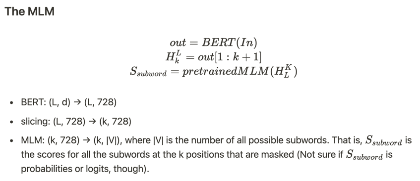
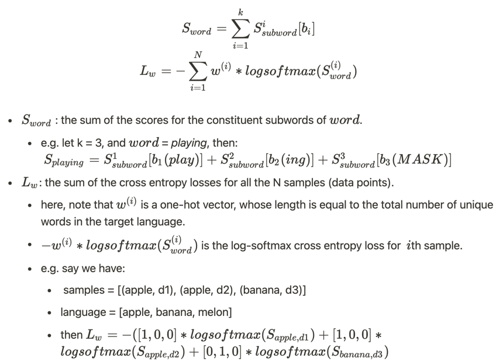

# Wisdomify
- [](https://colab.research.google.com/drive/1WH-ukPOV69lL41wkSPH8mi33AzCa3vQd?usp=sharing) 
- [](https://issue-25-wisdomify-eubinecto.endpoint.ainize.ai/search)

A BERT-based reverse-dictionary of Korean proverbs.
- 김유빈 : 모델링 / 데이터 수집 / 프로젝트 설계 / back-end
- 김종윤 : 데이터 수집 / 프로젝트 설계 / front-end / back-end
- 임용택 : 모델링 / deploy / back-end

Related Projects:
- Model design/analysis, proposal: [wisdomify/wisdomify](https://github.com/wisdomify/wisdomify)
- Data collect, Feature engineering: [wisdomify/storyteller](https://github.com/wisdomify/storyteller)
- Web service, Front-End: [wisdomify/platanus](https://github.com/wisdomify/platanus)

Objectives:
1. 빈도수 TOP 100 속담 검색을 목표로 한다.
2. 맥락 → 속담 검색을 목표로 한다.
3. 한국어 → 한국어 속담 검색이 가능하도록 한다.
4. 영어 → 한국어 속담 검색이 가능하도록 한다.
5. 우리는 해적. 우리와 같은 가치를 공유하는 사람이라면 기꺼이 동료로 받아들인다. 

## Quick Start

Check the dependencies:
```text
pytorch-lightning==1.3.7.post0
transformers==4.8.1
wandb==0.12.2
```
Clone the project and set up a virtualenv for the project:
```bash
git clone https://github.com/eubinecto/wisdomify.git
cd wisdomify
virtualenv wisdomifyenv
source wisdomifyenv/bin/activate  # activate the virtualenv
pip3 install -r ./requirements.txt  # install the required libraries onto the virtualenv
```

**[Requirement]: Weight and Bias Authentication**

This project uses "Weight and Bias (W&B)" for storing dataset and recording model experiment.

Therefore, if you try to whether 'train', 'eval' or 'infer' this model, you will be requested to authenticate via W&B login process.

The authentication process will be done only once when you run any script below 'main' directory.


Wisdomify a sentence:

```text
python3 -m wisdomify.main.infer --ver="0" --desc="까불지말고 침착하여라"
```
```text
### desc: 까불지말고 침착하여라 ###
0: (원숭이도 나무에서 떨어진다, 0.3917)
1: (산넘어 산, 0.2828)
2: (등잔 밑이 어둡다, 0.2192)
3: (가는 날이 장날, 0.0351)
4: (고래 싸움에 새우 등 터진다, 0.0264)
5: (꿩 대신 닭, 0.0241)
6: (갈수록 태산, 0.0197)
7: (핑계 없는 무덤 없다, 0.0009)
8: (서당개 삼 년이면 풍월을 읊는다, 0.0001)
9: (소문난 잔치에 먹을 것 없다, 0.0000)
```


## Related Work
- 기반이 되는 모델은 사전훈련된 **BERT** (Devlin et al., 2018)
- 정확히는 한국어 구어체를 사전학습한 **KcBERT**를 사용함 (Junbum, 2020)
- 사전훈련된 KcBERT를 **reverse-dictionary** task에 맞게 fine-tune함 (Yan et al., 2020)


How did I end up with Wisdomify?:
1. Word2Vec: `King = Queen - woman`, 이런게 된다는게 너무 재미있고 신기하다. 이걸로 게임을 만들어볼 수 있지 않을까? - [Toy 프로젝트: *word-chemist*](https://github.com/eubinecto/word-chemist)
2. 생각보다 잘 되는데? 그럼 Word2Vec로 reverse-dictionary도 구현할 수 있지 않을까? - [학사 졸업 프로젝트 - Idiomify](https://github.com/eubinecto/idiomify)
3. Sum of Word2Vectors로 reverse-dictionary를 구현하기에는 분명한 한계가 보인다. 문장의 맥락을 이해하는 Language Model은 없는가? - [논문 리뷰: *Attention is All you Need*](https://www.notion.so/Attention-is-All-you-Need-25bb9df8717940f899c1c6eb2a87aa43)    
4. Attention의 목적이 Contextualised embedding을 얻기 위함임은 알겠다. 그런데 왜 각 파라미터를 Q, K, V라고 이름지었는가? 무엇에 비유를 하는 것인가?- [What is Q, K, V? - Information Retrieval analogy](https://github.com/eubinecto/k4ji_ai/issues/40#issuecomment-699203963)
5. Contextualised embedding을 활용한 사례에는 무엇이 있는가? - [논문 리뷰: *Vokenization: Improving Language Understanding with Contextualized, Visual-Grounded Supervision*](https://www.notion.so/Vokenization-Improving-Language-Understanding-with-Contextualized-Visual-Grounded-Supervision-9abf06931d474dba89c181d5d1299dba)
6. Vokenisation 논문을 보니 BERT를 적극 활용하더라. BERT란 어떤 모델인가? - [집현전 중급 2조 BERT 논문리뷰](https://youtu.be/moCNw4j2Fkw)
7. 아, 혹시 사전훈련된 BERT를 활용한다면 적은 데이터를 가지고도 reverse-dictionary task를 구현할 수 있지 않을까? 누군가 이미 시도를 해보았을 것 같은데? - [논문리뷰: *BERT for Monolingual and Cross-Lingual Reverse Dictionary*](https://www.notion.so/BERT-for-Monolingual-and-Cross-Lingual-Reverse-Dictionary-29f901d082594db2bd96c54754e39414)
8. 로스함수를 이해했다. 한번 BERT로 간단한 reverse-dictionary를 구현해보자 - [Toy 프로젝트: fruitify - a reverse-dictionary of fruits!](https://github.com/eubinecto/fruitify) 
9. fruitify: [성공적인 첫 데모!](https://github.com/eubinecto/fruitify/issues/7#issuecomment-867341908)
10.  BERT로 reverse-dictionary를 구현하는 방법을 이해했고, 실재로 구현도 해보았다. 이제 생각해보아야 하는 것은 reverse-dictionary로 풀만한 가치가 있는 문제를
     찾는 것 - Wisdomify: 자기주도적으로 우리말 속담을 학습하는 것을 도와주는 reverse-dictionary.
     

## Methods

### The loss function

앞서 언급한 논문 (Yan et al., 2020)에서 제시한 reverse-dictionary task를 위한 loss:

[BERT for monolingual reverse-dictionary](https://www.notion.so/BERT-for-Monolingual-and-Cross-Lingual-Reverse-Dictionary-29f901d082594db2bd96c54754e39414#fdc245ac3f9b44bfa7fd1a506ae7dde2)|
--- |
 |
 |


### `conf.json`
The `conf.json` on project directory must have format as following. The value type and meaning are written as value of json.

The hyper paramters for the model must be written below "_experiment version.model"

```json
"_experiment version": {
      "_주의사항!": "추후 버전 추가에 따라 파라미터가 추가되면 해당 파라미터를 아래 설명 추가해주세요",
      "exp_name": "(Str) 해당 실험의 간략한 이름을 적어주세요.",
      "exp_desc": "(Str) 해당 실험에 대한 정보를 간결하지만 명확하게 적어주세요.",
      "wandb": {
        "_주의사항!": "이 곳의 명세는 반드시 W&B 페이지에 접속하여 사용할 아티펙트의 이름, 명세를 정확하게 확인하세요.",
        "load": {
          "_주의 (RD)!": "RD 관련 명세는 infer와 eval에만 사용됩니다. Train시 빈칸으로 두어도 무방합니다. (특별한 케이스가 아니면 동일하게 해주세요.)",
          "rd_name": "(Str) WandB에서 로드할 RD 아티펙트의 이름을 적어주세요.",
          "rd_ver": "(Str) WandB에서 로드할 RD 아티펙트의 버전을 적어주세요. (default: latest, 아무것도 적지 않으면 됩니다.)",
          "mlm_name": "(Str) WandB에서 로드할 BERT mlm 아티펙트의 이름을 적어주세요.",
          "mlm_ver": "(Str) WandB에서 로드할 BERT mlm 아티펙트의 버전을 적어주세요. (default: latest, 아무것도 적지 않으면 됩니다.)",
          "tokenizer_name": "(Str) WandB에서 로드할 BERT tokenizer 아티펙트의 이름을 적어주세요.",
          "tokenizer_ver": "(Str) WandB에서 로드할 BERT tokenizer 아티펙트의 버전을 적어주세요. (default: latest, 아무것도 적지 않으면 됩니다.)",
          "data_name": "(Str) 해당 모델 트레이닝에 사용된 데이터 이름",
          "data_version": "(Str) 해당 모델 트레이닝에 사용된 데이터 버전",
          "data_type": "(Str) 해당 모델 트레이닝에 사용된 데이터의 타입 (definition, example)"
        },
        "save": {
          "_주의 1": "mlm, tokenizer 그리고 rd의 이름은 반드시 'mlm_' / 'tokenizer_' / 'rd_' 로 시작해야합니다.",
          "_주의 2": "mlm 혹은 tokenizer를 W&B에 저장하지 않을 시, 빈 string으로 이름을 설정하면됩니다.",
          "rd_name": "(Str) WandB에서 로드할 RD 아티펙트의 이름을 적어주세요.",
          "rd_desc": "(Str) WandB에서 로드할 RD 아티펙트의 설명을 적어주세요. (default: None)",
          "mlm_name": "(Str) WandB에 저장할 BERT mlm 아티펙트의 이름을 적어주세요.",
          "mlm_desc": "(Str) WandB에 저장할 BERT mlm 아티펙트의 설명을 적어주세요. (default: None)",
          "tokenizer_name": "(Str) WandB에 저장할 BERT tokenizer 아티펙트의 이름을 적어주세요.",
          "tokenizer_desc": "(Str) WandB에 저장할 BERT tokenizer 아티펙트의 설명을 적어주세요. (default: None)"
        }
      },
      "model": {
        "rd_model": "(Str) 사용할 RD_model 클래스 이름을 적어주세요. (해당 클래스가 작성되어 있지 않으면 NotImplementedError 발생합니다.)",
        "X_mode": "(Str) 사용할 XBuilder 클래스 이름을 적어주세요. (해당 클래스가 작성되어 있지 않으면 NotImplementedError 발생합니다.)",
        "y_mode": "(Str) 사용할 YBuilder 클래스 이름을 적어주세요. (해당 클래스가 작성되어 있지 않으면 NotImplementedError 발생합니다.)",
        "k": "(Int) 최대 길이 설정",
        "lr": "(Float) learning rate 설정",
        "max_epochs": "(Int) 최대 에폭값",
        "batch_size": "(Int) 배치사이즈",
        "repeat": "(Int) 반복 횟수",
        "num_workers": "(Int) 워커 개수 (해당 컴퓨터 사양에 맞춰 작성하세요. CPU의 경우 코어 개수이하여야합니다.)",
        "shuffle": "(Bool) 셔플여부"
      },
      "wisdoms": "(List[Str]) - 검색할 속담 리스트"
    },
```
The hyper parameters used for `version_0` is:

```json
"model": {
  "rd_model": "RDAlpha",
  "X_mode": "XBuilder",
  "y_mode": "YBuilder",
  "k": 11,
  "lr": 0.00001,
  "max_epochs": 40,
  "batch_size": 30,
  "num_workers": 0,
  "shuffle": true
},
"wisdoms": [
  "가는 날이 장날",
  "갈수록 태산",
  "꿩 대신 닭",
  "등잔 밑이 어둡다",
  "소문난 잔치에 먹을 것 없다",
  "핑계 없는 무덤 없다",
  "고래 싸움에 새우 등 터진다",
  "서당개 삼 년이면 풍월을 읊는다",
  "원숭이도 나무에서 떨어진다",
  "산 넘어 산"
]
```

### Training

```text
python3 -m wisdomify.main.train --ver="0"
```
- 훈련셋에서 로스가 0에 수렴할 때 까지 훈련을 진행함. 가능한 빠른 시일 내에 프로토타입을 만들어보는것이 목표였으므로, 일단 validation/test set 구축을 스킵,
오버피팅이 되더라도 훈련 셋에만 핏을 함.
- 사이즈가 상당히 크므로, 나중에 knowledge distilation (Hinton, 2015)으로 경량화하는 것도 고려해봐야할 것.

### Dataset
- 10개의 속담 별로 5개의 서로다른 정의를 구글링으로 손수 수집. 사이즈가 작으므로 그냥 repo에 업로드 함: [wisdom2def](https://github.com/eubinecto/wisdomify/blob/main/data/wisdom2def.tsv)
- 추후 데이터를 더 수집하게 되면 kaggle이나 dropbox에 업로드 해서 접근하는 편이 나을 것.

### Evaluation

```text
python3 -m wisdomify.main.eval --ver="0"
```

## Examples

### Positive examples

- *갈수록 어렵다*
```
### desc: 갈수록 어렵다 ###
0: ('산넘어 산', 0.9999836683273315)
1: ('갈수록 태산', 1.6340261936420575e-05)
2: ('꿩 대신 닭', 4.177704404639826e-09)
3: ('핑계 없는 무덤 없다', 4.246608897862103e-10)
4: ('원숭이도 나무에서 떨어진다', 4.91051192763603e-11)
5: ('가는 날이 장날', 3.620301280982119e-11)
6: ('등잔 밑이 어둡다', 3.410518395474682e-12)
7: ('고래 싸움에 새우 등 터진다', 2.889838230366905e-14)
8: ('소문난 잔치에 먹을 것 없다', 2.270246673757772e-14)
9: ('서당개 삼 년이면 풍월을 읊는다', 2.424753148985129e-15)
```

- *근처에 있을 것이라고는 전혀 예상하지 못했다*
```
### desc: 근처에 있을 것이라고는 전혀 예상하지 못했다 ###
0: ('등잔 밑이 어둡다', 0.934296190738678)
1: ('원숭이도 나무에서 떨어진다', 0.04902056232094765)
2: ('산넘어 산', 0.010009311139583588)
3: ('가는 날이 장날', 0.005946608260273933)
4: ('소문난 잔치에 먹을 것 없다', 0.0002701274352148175)
5: ('고래 싸움에 새우 등 터진다', 0.0002532936632633209)
6: ('갈수록 태산', 0.00010314056999050081)
7: ('핑계 없는 무덤 없다', 9.196436440106481e-05)
8: ('꿩 대신 닭', 8.55061716720229e-06)
9: ('서당개 삼 년이면 풍월을 읊는다', 3.365390739418217e-07)
```


- *너 때문에 관계없는 내가 피해봤잖아*
```
### desc: 너 때문에 관계없는 내가 피해봤잖아 ###
0: ('고래 싸움에 새우 등 터진다', 0.9243378043174744)
1: ('가는 날이 장날', 0.028463557362556458)
2: ('핑계 없는 무덤 없다', 0.026872390881180763)
3: ('등잔 밑이 어둡다', 0.012348096817731857)
4: ('소문난 잔치에 먹을 것 없다', 0.003390798345208168)
5: ('산넘어 산', 0.0026215193793177605)
6: ('갈수록 태산', 0.0010220635449513793)
7: ('원숭이도 나무에서 떨어진다', 0.0004960462101735175)
8: ('꿩 대신 닭', 0.00044754118425771594)
9: ('서당개 삼 년이면 풍월을 읊는다', 6.364324889318596e-08)
```

- *쓸데없는 변명은 그만 둬*
```
### desc: 쓸데없는 변명은 그만둬 ###
0: ('핑계 없는 무덤 없다', 0.6701037287712097)
1: ('꿩 대신 닭', 0.17732197046279907)
2: ('산넘어 산', 0.1395266205072403)
3: ('갈수록 태산', 0.01272804755717516)
4: ('가는 날이 장날', 0.00020182589651085436)
5: ('원숭이도 나무에서 떨어진다', 0.0001034122469718568)
6: ('고래 싸움에 새우 등 터진다', 1.2503404832386877e-05)
7: ('등잔 밑이 어둡다', 1.5657816447856021e-06)
8: ('소문난 잔치에 먹을 것 없다', 2.735970952016942e-07)
9: ('서당개 삼 년이면 풍월을 읊는다', 3.986170074576911e-11)
```

속담의 용례를 입력으로 주어도 용례에 맞는 속담을 예측할 수 있을까? 각 속담의 사전적 정의만 훈련에 사용되었다는 것을 고려해보았을 때,
만약 이것이 가능하다면 사전학습된 weight를 십분활용하고 있다는 것의 방증이 될 것. 

- *커피가 없으니 홍차라도 마시자*
```
### desc: 커피가 없으니 홍차라도 마시자 ###
0: ('꿩 대신 닭', 0.5670634508132935)
1: ('가는 날이 장날', 0.15952838957309723)
2: ('산넘어 산', 0.14466965198516846)
3: ('등잔 밑이 어둡다', 0.10353685170412064)
4: ('소문난 잔치에 먹을 것 없다', 0.006912065204232931)
5: ('갈수록 태산', 0.00646367808803916)
6: ('서당개 삼 년이면 풍월을 읊는다', 0.006029943469911814)
7: ('원숭이도 나무에서 떨어진다', 0.004639457445591688)
8: ('핑계 없는 무덤 없다', 0.0011017059441655874)
9: ('고래 싸움에 새우 등 터진다', 5.46958799532149e-05)
```

- *그 애가 도망쳐 버렸으면 아무나 대신 잡아넣어 숫자를 채워야 할 게 아니냐?*
```
### desc: 그 애가 도망쳐 버렸으면 아무나 대신 잡아넣어 숫자를 채워야 할 게 아니냐? ###
0: ('꿩 대신 닭', 0.6022371649742126)
1: ('등잔 밑이 어둡다', 0.3207240402698517)
2: ('서당개 삼 년이면 풍월을 읊는다', 0.03545517101883888)
3: ('가는 날이 장날', 0.012123783119022846)
4: ('갈수록 태산', 0.011005728505551815)
5: ('원숭이도 나무에서 떨어진다', 0.010867268778383732)
6: ('핑계 없는 무덤 없다', 0.004052910953760147)
7: ('산넘어 산', 0.002024132991209626)
8: ('고래 싸움에 새우 등 터진다', 0.0013805769849568605)
9: ('소문난 잔치에 먹을 것 없다', 0.00012919674918521196)

```

- *나는 어릴 적부터 카센터에서 잡일을 도맡아 하다 보니 이젠 혼자서 자동차 수리도 할수 있다.*
```
### desc: 나는 어릴 적부터 카센터에서 잡일을 도맡아 하다 보니 이젠 혼자서 자동차 수리도 할수 있다. ###
0: ('서당개 삼 년이면 풍월을 읊는다', 0.5147183537483215)
1: ('등잔 밑이 어둡다', 0.34899067878723145)
2: ('가는 날이 장날', 0.12019266188144684)
3: ('원숭이도 나무에서 떨어진다', 0.011380248703062534)
4: ('산넘어 산', 0.002991838613525033)
5: ('갈수록 태산', 0.0007551977760158479)
6: ('꿩 대신 닭', 0.0004372508847154677)
7: ('소문난 잔치에 먹을 것 없다', 0.00040235655615106225)
8: ('고래 싸움에 새우 등 터진다', 7.436128362314776e-05)
9: ('핑계 없는 무덤 없다', 5.710194818675518e-05)
```

- *맛집이라길래 일부러 먼길을 달려왔는데 막상 먹어보니 맛이 없더라*
```
### desc: 맛집이라길래 일부러 먼길을 달려왔는데 막상 먹어보니 맛이 없더라 ###
0: ('소문난 잔치에 먹을 것 없다', 0.5269527435302734)
1: ('서당개 삼 년이면 풍월을 읊는다', 0.2070106714963913)
2: ('가는 날이 장날', 0.15454722940921783)
3: ('등잔 밑이 어둡다', 0.11061225831508636)
4: ('꿩 대신 닭', 0.0006726137944497168)
5: ('원숭이도 나무에서 떨어진다', 0.0001451421994715929)
6: ('산넘어 산', 3.2266420021187514e-05)
7: ('핑계 없는 무덤 없다', 1.288024850509828e-05)
8: ('갈수록 태산', 1.0781625860545319e-05)
9: ('고래 싸움에 새우 등 터진다', 3.4537756619101856e-06)
```

### Negative examples

검색할 수 있는 속담이 모두 부정적인 속담이라서 그런지, 긍정적인 문장이 입력으로 들어오면 제대로 예측을 하지 못한다:
- *결과가 좋아서 기쁘다*
```
0: ('산넘어 산', 0.9329468011856079)
1: ('갈수록 태산', 0.05804209038615227)
2: ('꿩 대신 닭', 0.006065088324248791)
3: ('가는 날이 장날', 0.002668046159669757)
4: ('원숭이도 나무에서 떨어진다', 0.00024604308418929577)
5: ('핑계 없는 무덤 없다', 3.138219108222984e-05)
6: ('등잔 밑이 어둡다', 4.152606720708718e-07)
7: ('소문난 잔치에 먹을 것 없다', 2.1668449790013256e-07)
8: ('고래 싸움에 새우 등 터진다', 2.008734867331441e-08)
9: ('서당개 삼 년이면 풍월을 읊는다', 1.0531459260221254e-08)
```

"소문난 잔치에 먹을 것 없다"와 동일한 의미를 지님에도 불구하고, "실제로는 별거 없네"를 입력으로 받으면 "산 넘어 산"이 1등으로 출력. 하지만
훈련 셋에 포함된 샘플인 "소문과 실제가 일치하지 않는다"를 입력으로 받으면 정확하게 예측함. 즉 모델이 훈련셋에 오버피팅이 된 상태임을 확인할 수 있다:
- *실제로는 별거없네* (훈련 셋에 포함되지 않은 정의)
```
### desc: 실제로는 별거없네 ###
0: ('산넘어 산', 0.9976289868354797)
1: ('갈수록 태산', 0.002168289152905345)
2: ('꿩 대신 닭', 0.00020149812917225063)
3: ('핑계 없는 무덤 없다', 9.218800869348343e-07)
4: ('등잔 밑이 어둡다', 1.6546708536679944e-07)
5: ('가는 날이 장날', 1.0126942839860931e-07)
6: ('원숭이도 나무에서 떨어진다', 9.898108288552976e-08)
7: ('소문난 잔치에 먹을 것 없다', 6.846833322526891e-09)
8: ('고래 싸움에 새우 등 터진다', 4.417973487047533e-10)
9: ('서당개 삼 년이면 풍월을 읊는다', 8.048845877989264e-14)
```
- *소문과 실제가 일치하지 않는다* (훈련 셋에 포함된 정의)
```
### desc: 소문과 실제가 일치하지 않는다. ###
0: ('소문난 잔치에 먹을 것 없다', 0.999997615814209)
1: ('등잔 밑이 어둡다', 1.7779053678168566e-06)
2: ('가는 날이 장날', 5.957719508842274e-07)
3: ('갈수록 태산', 9.973800452200976e-09)
4: ('핑계 없는 무덤 없다', 2.4250623731347787e-09)
5: ('고래 싸움에 새우 등 터진다', 5.40873457133273e-10)
6: ('산넘어 산', 4.573414147390764e-10)
7: ('원숭이도 나무에서 떨어진다', 2.8081562075676914e-10)
8: ('꿩 대신 닭', 2.690336287081152e-10)
9: ('서당개 삼 년이면 풍월을 읊는다', 3.8126671958460534e-11)
```
- *소문이랑 다르네* ("소문"이라는 단어에는 민감하게 반응한다.) 
```
### desc: 소문이랑 다르네 ###
0: ('산넘어 산', 0.9770968556404114)
1: ('소문난 잔치에 먹을 것 없다', 0.01917330175638199)
2: ('갈수록 태산', 0.0035712094977498055)
3: ('꿩 대신 닭', 8.989872731035575e-05)
4: ('가는 날이 장날', 6.370477785822004e-05)
5: ('핑계 없는 무덤 없다', 1.7765859183782595e-06)
6: ('원숭이도 나무에서 떨어진다', 1.6799665445432765e-06)
7: ('등잔 밑이 어둡다', 1.6705245116099832e-06)
8: ('고래 싸움에 새우 등 터진다', 3.0059517541758396e-08)
9: ('서당개 삼 년이면 풍월을 읊는다', 4.33282611178587e-11)
```

## Future Work
- wisdomify task에 적합한 BERT 모델 선정하기 https://github.com/eubinecto/wisdomify/issues/1#issue-930238726
- 10개의 속담에서 현용되는 모든 우리말 속담으로 search space를 확장하기 https://github.com/eubinecto/wisdomify/issues/7#issue-931145700
- 우리말 속담의 용례를 각 속담 별로 적어도 30개는 수집하기  https://github.com/eubinecto/wisdomify/issues/4#issue-930691961
- 우리말 속담 용례 말뭉치로 domain adoption 진행하기 (Gururangan et al., 2020)
- feature engineering: `[ClS]`의 hidden representation에 sentiment classifier를 달아서 로스함수에 활용하기
- 모델의 접근성을 높이기 위해 웹에 모델을 deploy하기. back-end로는 django (유빈), front-end로는 vue.js (종윤)를 사용하자

## References
- Devlin,  J. Cheng, M. Lee, K. Toutanova, K. (2018). *: Pre-training of Deep Bidirectional Transformers for Language Understanding*. 
- Gururangan, S. Marasović, A. Swayamdipta, S. Lo, K. Beltagy, I. Downey, D. Smith, N. (2020). *Don't Stop Pretraining: Adapt Language Models to Domains and Tasks*
- Hinton, G. Vinyals, O. Dean, J. (2015). *Distilling the Knowledge in a Neural Network*
- Junbum, L. (2020). *KcBERT: Korean Comments BERT*
- Yan, H. Li, X. Qiu, X. Deng, B. (2020). *BERT for Monolingual and Cross-Lingual Reverse Dictionary*
